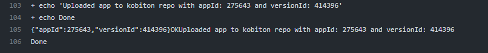

# Kobiton Action for Upload Mobile App

This is a GitHub action that allows you to utilize Kobiton upload service, which makes it convenient for auto uploading a new app, or a new version for existing app.

## Table of Contents

1. [Getting Started](#getting-started)
   - [Setup workflow and action](#setup-workflow-and-action)
   - [Setup secrets for private items](#setup-secrets-for-private-items)
2. [Input Variables](#input-variables)
3. [App uploading result](#app-uploading-result)
4. [Some Notes](#some-notes)
5. [License](#license)

## Getting Started

### Setup Workflow and Action

To get started using the action for your project, create a folder called **.github** and inside it, create another folder called **workflows**. Finally inside the workflows folder, create a file called **main.yml** or any name with the following contents:

_.github/workflows/main.yml_

```yaml
on:
  push:
    branches:
      - main

jobs:
  upload-app:
    runs-on: ubuntu-latest
    name: Input name for the job
    steps:
      - uses: actions/checkout@v3
      - uses: kobiton/upload-mobile-app-github-action@<<version>>
        with:
          kobi_username: ${{ secrets.KOBI_USERNAME }}
          kobi_api_key: ${{ secrets.KOBI_API_KEY }}
          upload_app_id: 275643
          app_name: Android-test
          app_path: ./app-to-upload/android-test.apk # this is the file to upload
          app_access: public
          app_suffix: apk
```

_For more info about how to customize a workflow, check out the [GitHub Actions documentation for workflow](https://docs.github.com/en/actions/using-workflows/workflow-syntax-for-github-actions). You can trigger the action on many other kinds of event._

### Setup Secrets for private items

Kobiton Username and API key are required for authenticating with Kobiton API.

> If you don't have a Kobiton account, visit https://portal.kobiton.com/register to create one.

To get your Kobiton Username and API Key, follow instructions at `IV. Configure Test Script for Kobiton` section on [our blog](https://kobiton.com/blog/tutorial/parallel-testing-selenium-webdriver/).

In your Repo, go to Settings -> Secrets/Actions and click on "New repository secret". Then enter KOBI_USERNAME as the name and paste the suitable value. The same process is followed for KOBI_API_KEY.

_For more info about how to setup kinds of secrets, check out the [GitHub Actions documentation for secrets](https://docs.github.com/en/actions/security-guides/encrypted-secrets)_

You can now push your project to GitHub and it will be automatically triggered the action.

Success, right? You learn more about GitHub Actions [here](https://docs.github.com/en/actions)

## Input Variables

The action comes with additional options that you can use to configure the workflow. You can setup these values inside the "with" object as presented above:

| Input Environment Variable | Required | Description                                                                                                | Examples                         |
| -------------------------- | -------- | ---------------------------------------------------------------------------------------------------------- | -------------------------------- |
| kobi_username              | yes      | The user in Kobiton                                                                                        | _secret_                         |
| kobi_api_key               | yes      | Specific key to access Kobiton API                                                                         | _secret_                         |
| upload_app_id              | optional | App ID in Kobiton - use this in case you want to upload new version of an existing app in Kobiton          | 275643                           |
| app_access                 | yes      | You can either to make this app private or available for everyone in the organization (private vs. public) | public                           |
| app_name                   | yes      | Title of the app to be built                                                                               | Android-test                     |
| app_path                   | yes      | Path to the app .apk or .ipa file (should be in the same repo and relative from your current point)        | ./app-to-upload/android-test.apk |
| app_suffix                 | yes      | Type of the app to be uploaded - Android (apk) or iOS (ipa)                                                | apk                              |

## App uploading result

The result will be shown on GitHub Actions console, and the app/app version will be shown in Kobiton Portal.



## Some Notes

- You can find the secrets tab in your project's settings

- If you're using the above exact workflow code, keep in mind that it deploys whenever you make a change to the main branch (Even README updates which have nothing to do with application code) and that might not be very efficient for you, have a look through the GitHub Actions documents to customize when the action should trigger.

- When you face any issues with the action, feel free to open an issue for our [GitHub repository](https://github.com/kobiton/upload-mobile-app-github-action/issues)

## License

This project is licensed for the MIT License [here](LICENSE).
